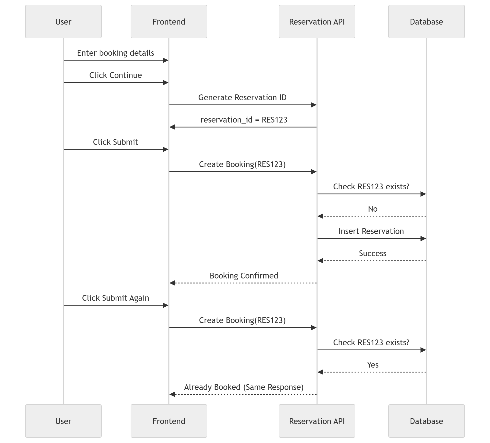

# Preventing Double Booking in Reservation Systems

## Problem Statement

One of the most critical problems in hotel, room, or ticket reservation systems is **double booking**.

This usually happens in two common scenarios:

1. **Same user clicks the Book button multiple times**
   - Due to slow internet or impatience, the user clicks the submit button repeatedly.

2. **Multiple users try to book the same room at the same time**
   - Example: Two users attempt to reserve Room 101 for the same dates simultaneously.

If not handled properly, the system may create duplicate reservations or oversell inventory.

---

# Real World Scenarios

## Scenario 1: Multiple Clicks by Same User

Rahul selects a room and clicks **Book Now**.

Because the page is slow, he clicks 3 times.

Without protection:

- 3 booking requests go to server
- 3 reservations may get created
- User gets charged multiple times

---

## Scenario 2: Two Users Booking Same Room

Two users attempt to reserve the last available room:

- User A clicks Book at 10:00:01
- User B clicks Book at 10:00:01

Without concurrency control:

- Both requests succeed
- Same room assigned twice

---

# Solution Overview

To solve double booking, use multiple layers of protection:

1. Client-side Button Disable
2. Idempotent APIs
3. Database Unique Constraints
4. Inventory Locking / Transaction Control

---

# 1. Client Side Protection

After user clicks **Submit**, disable the button immediately.

# 2. Idempotent APIs

Using Idempotent API's

